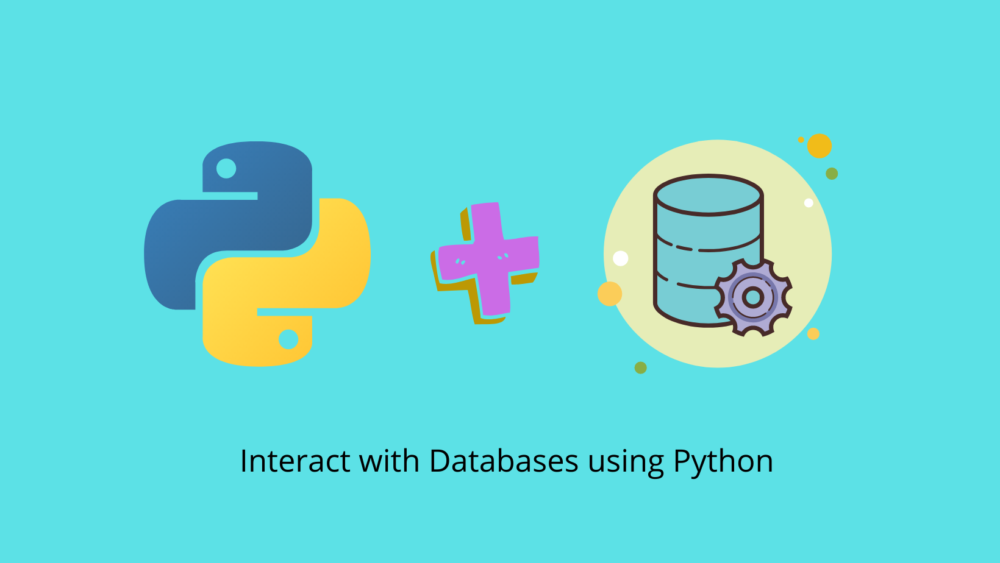

# Interact with Databases Using Python3

## Table Of Contents

1. [Overview](#overview)
2. [SQLite](#sqlite)
3. [PostgreSQL](#postgresql)

# **Overview**

This repository intends to help beginners connect and manipulate databases such as SQLite and PostgreSQL using python. One can find functions in respective python files on how to establish connection with the database, create table, insert a new entry, update an existing entry and delete an entry.

> Audience: Beginner,
> Language: Python

# 1. SQLite  

SQLite is an embedded database and runs within the application. It is 'serverless' database meaning, it does not require a server to operate. There is no configuration required for the setup process. SQLite is very small and light weight, less than 400KiB fully configured. SQLite is self-contained, which means no external dependencies are required. The library required to work with sqlite in python is `sqlite3` which comes pre-installed with python. If you aim to build small scale applications, SQLite database can provide the easiest way to get started.

- `sqlite_connection.py` file explains the first 5 steps to interact with a database.

- `sqlite.py` file holds basic methods to perform following actions:

1. Create connection to a sqlite database
2. Add/Insert values into the table
3. Update values of the table
4. Delete values from the table
5. View the table values

# 2. PostgreSQL 

To work with PostgreSQL, you need to install PostgreSQl through one of the methods listed in the
[site](https://www.postgresql.org/download/). Then enter username and password for the server and take a note of the port. A database is already created which can be connected using below code (refer 'postgresql.py' for deatils):

`psycopg2.connect("dbname='database-name', user='user-name', password='password' host='localhost' port='port-name'")`

The databases can be viewed, managed and developed using a graphical tool called pgAdmin.

- `postgresql.py` file holds basic methods to perform following actions on a postgresql database:

1. Create connection to a sqlite database
2. Add/Insert values into the table
3. Update values of the table
4. Delete values from the table
5. View the table values
